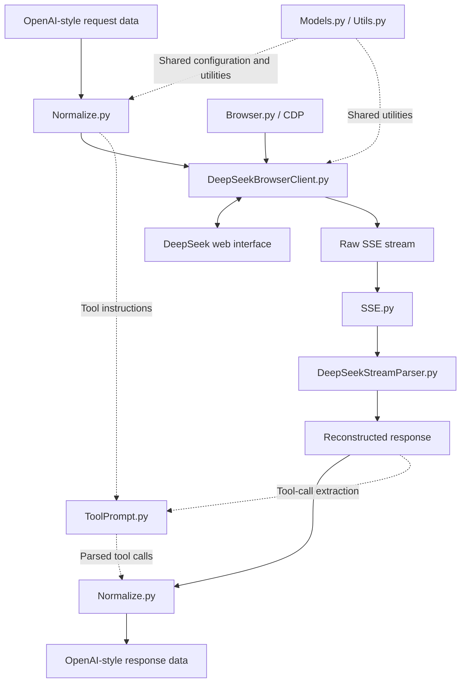

```mermaid
flowchart TD
    A[OpenAI-style request data] --> B[Normalize.py]
    B --> C[DeepSeekBrowserClient.py]
    D[Browser.py / CDP] --> C
    C <--> E[DeepSeek web interface]
    C --> F[Raw SSE stream]
    F --> G[SSE.py]
    G --> H[DeepSeekStreamParser.py]
    H --> I[Reconstructed response]
    I --> J[Normalize.py]
    J --> K[OpenAI-style response data]
    B -. Tool instructions .-> L[ToolPrompt.py]
    I -. Tool-call extraction .-> L
    L -. Parsed tool calls .-> J
    M[Models.py / Utils.py] -. Shared configuration and utilities .-> B
    M -. Shared utilities .-> C
```