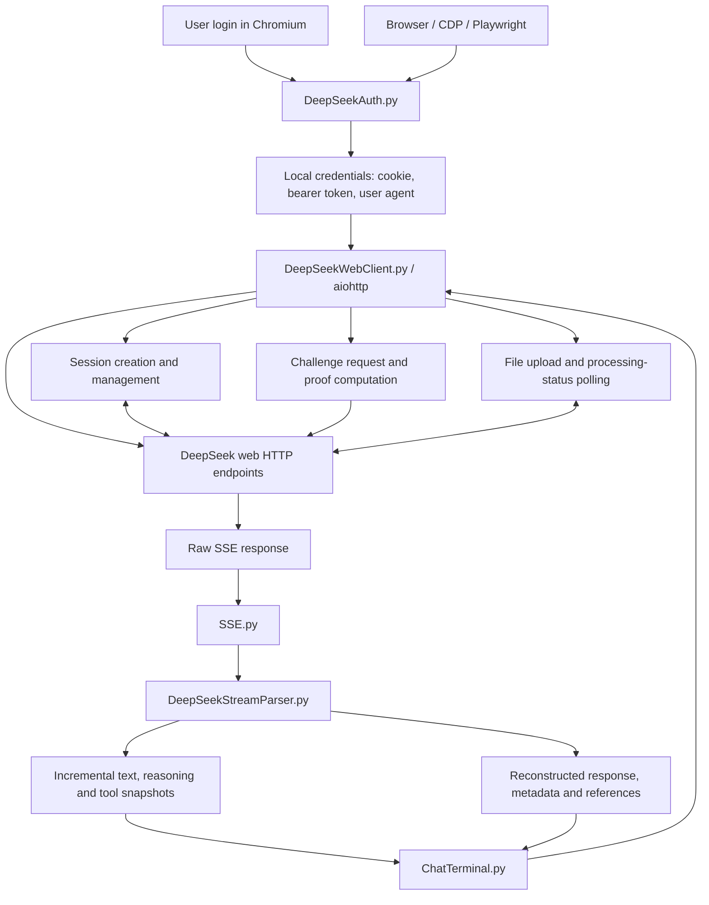

```mermaid
flowchart TD
    A[User login in Chromium] --> B[DeepSeekAuth.py]
    C[Browser / CDP / Playwright] --> B
    B --> D[Local credentials: cookie, bearer token, user agent]
    D --> E[DeepSeekWebClient.py / aiohttp]
    F[ChatTerminal.py] --> E
    E --> G[Session creation and management]
    E --> H[DeepSeek web HTTP endpoints]
    G <--> H
    E --> I[Challenge request and proof computation]
    I --> H
    H --> J[Raw SSE response]
    J --> K[SSE.py]
    K --> L[DeepSeekStreamParser.py]
    L --> M[Incremental text, reasoning and tool snapshots]
    L --> N[Reconstructed response, metadata and references]
    M --> F
    N --> F
    E --> O[File upload and processing-status polling]
    O <--> H
```